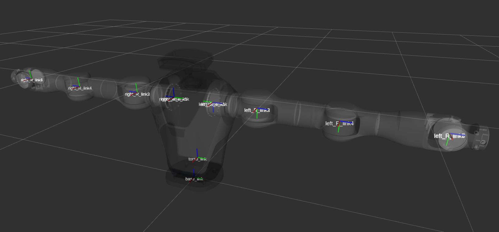
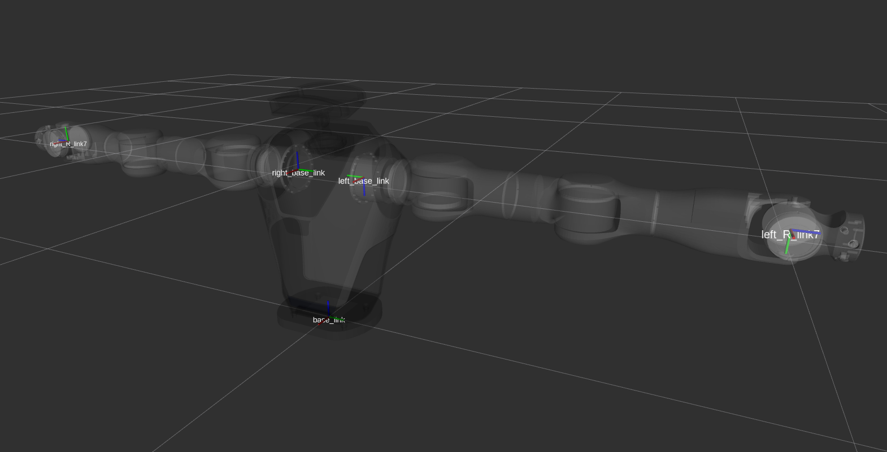

# Marvin Description

This package contains the URDF, meshes, and configuration files for the Marvin robot, adapted for ROS 2.

## Features

- Robot model (URDF/Xacro)
- 3D meshes for visualization and collision
- Configuration files for simulation and control

## Usage

Clone this repository into your ROS 2 workspace:

```bash
cd ~/tianji_ws/src
git clone <repository_url>
cd ..
colcon build
```

To view the robot in RViz2:

```bash
ros2 launch marvin_description display.launch.py
```

## Directory Structure

- `urdf/` - Robot description files
- `meshes/` - 3D models
- `launch/` - Launch files

## Robot Frame Definations



*Figure: Marvin robot visualization in RViz2.*


*Figure: Marvin base link and important frames.*
## Requirements

- ROS 2 (Foxy/Galactic/Humble, etc.)
- `robot_state_publisher`
- `rviz2`

## License

See [LICENSE](LICENSE) for details.

## Maintainer

Tianhao  
tianhao@example.com